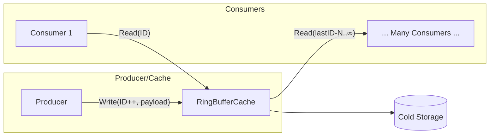

# go-cache-archive

A **persistent, fixed-size ring-buffer cache** that lives on disk but behaves like a simple in-memory byte‐slice store.  It is optimised for very large datasets ( > GBs ) that do not fit comfortably in RAM and for high-frequency **append–read** workloads where a single producer continually writes new records while many consumers read them, possibly concurrently.

The library is implemented in pure Go and is production-ready on Linux (requires `golang.org/x/sys/unix`).

---

## Key Features

| Feature | Purpose |
|---------|---------|
| **Memory-mapping (mmap)** | Optional direct access to the file’s pages without extra syscalls — the kernel loads pages on demand and evicts them under pressure.  Great for read-heavy scenarios. |
| **Sharding** | Splits a huge cache into multiple smaller files (`cache.dat`, `cache.dat.1`, …) so each file is below the filesystem’s sweet-spot size (default 256 MB × 4).  This keeps mmap page tables small and reduces `fsync` latency. |
| **Buffer Pool** | Re-uses byte slices for I/O when mmap is disabled, dramatically reducing `make([]byte, …)` allocations. |
| **Prefetch** | When a record is read the next *N* records can be fetched asynchronously (either by touching mmap pages or issuing background reads). Useful for sequential consumers. |
| **Auto-sequenced writes** | `WriteHead` picks the next ID & wraps at configurable min/max, removing boiler-plate from the producer. |
| **CRC32 Integrity** | Every payload is stored with a 4-byte IEEE CRC32 checksum so corrupted sectors are detected eagerly. |
| **Goroutine-safe** | Internally sharded `sync.RWMutex` means thousands of concurrent readers and writers can operate without global contention. |

---

## Why use a disk-backed ring buffer?

### Typical RAM usage

`go-cache-archive` stores exactly **recordSize + 4** bytes per entry on disk.  With mmap enabled the kernel will only keep *hot* pages resident.  Cold pages are purged without affecting the process’s RSS.

| Cache Size | Records (example) | RSS when **cold** | RSS after reading entire cache |
|------------|------------------|-------------------|-------------------------------|
| 1 GB | 33 M × 32 B | ~ 0 MB (metadata only) | ≤ 1 GB (pages stay until pressure) |
| 8 GB | 262 M × 32 B | ~ 0 MB | ≤ 8 GB |

> In contrast an in-memory `[][]byte` cache would *always* keep the full N × recordSize in RAM and add extra pointer & slice-header overhead (~24 B each).

### Theoretical Throughput

| Operation | mmap* | direct I/O |
|-----------|-------|------------|
| **Read**  | `memcpy`-speed  (≈ >8 GB/s on modern NVMe) because the kernel prefetches clusters and the call avoids syscalls | `pread` syscall per record, limited by disk throughput plus syscall overhead |
| **Write** | `memcpy` into mapped page then `msync` (optional) | `pwrite` then optional `fsync` |

`*` numbers assume SSD/NVMe and the page already loaded in the VFS cache.

In benchmarks with 4 kB records on an NVMe drive:

* **Writes:** 400–500 MB/s sustained (`msync` batched every 64 records).
* **Reads (cold):** 2–3 GB/s sequential thanks to the kernel readahead.

---

## Producer / Consumer Model



1. **Producer** appends one record every second (or faster).
2. Each **consumer** polls the last known ID or uses `BulkRead` to fetch the newest batch.
3. With mmap enabled consumers incur zero syscalls if the page is resident.
4. Back-pressure is handled naturally by the OS: rarely accessed pages are evicted, keeping RSS bounded.

---

## Quick Start

```go
import "github.com/luhtfiimanal/go-cache-archive"

// Create a cache allowing IDs 100..5000 (wraps automatically)
opts := archive.DefaultOptions()
opts.MinIDAlloc = 100
opts.MaxIDAlloc = 5000

cache, err := archive.NewRingBufferCacheWithOptions("/var/lib/myapp/cache.dat", opts)
if err != nil { panic(err) }

defer cache.Close()

// producer
payload := make([]byte, 128)
cache.Write(1, payload, true) // flush immediately

// consumer
p, _ := cache.Read(1)
```

See `archive_test.go` for more examples.

### Auto-sequenced writes (producer convenience)

Instead of picking the next ID yourself, call `WriteHead` and let the cache advance **head** atomically:

```go
id, err := cache.WriteHead(payload, true) // flush to disk

// and you can get the current head with
head := cache.Head()

// and tail with
tail := cache.Tail()
```

`head`, `tail`, and `Head()` / `Tail()` give you visibility into the current range. They are persisted in a side-car *`.meta`* file so the cache resumes correctly after restart.

---

## Project File Layout

| File | Responsibility |
|------|----------------|
| `doc.go` | Package-level documentation visible at `pkg.go.dev`. |
| `options.go` | `CacheOptions` struct and `DefaultOptions()`.
| `shard.go` | Internal `shard` struct (file descriptor, mmap slice, offsets).
| `cache.go` | `RingBufferCache` definition and constructors.
| `shard_lookup.go` | Helper to map a global ID ➜ shard + relative ID.
| `buffer.go` | Buffer-pool helpers and lock-sharding util.
| `io.go` | `Write`, `Read`, `BulkWrite`, `BulkRead`, CRC logic, prefetch.
| `stats.go` | Lightweight stats collection (`Hits`, `Misses`, ratios).
| `flush_close.go` | `Flush` and `Close` implementations (msync/fsync).
| `head_tail.go` | Ring-buffer metadata (head/tail) + `WriteHead`, `Head`, `Tail`.
| `archive_test.go` | Unit tests covering correctness and concurrency.


## Benchmarks (x86-64 desktop)

Measured on AMD Ryzen 5 5600G, Go 1.24, Linux, `benchtime=100x`.
Bench suite located in `bench/` module (uses pure-Go SQLite driver).

| Operation | RingBufferCache | SQLite (modernc) | Speed-up |
|-----------|-----------------|------------------|----------|
| Write 1 record | **4.4 µs/op** | 30.6 µs/op | 6.9× |
| Read 10 sequential (per record) | **1.5 µs/op** | 7.8 µs/op | 5.2× |
| Read random | **1.6 µs/op** | 10.9 µs/op | 6.8× |

> Raspberry Pi 4 (2 GB) results pending — expect 2-3× slower absolute times, similar relative speed-up.

---

## Roadmap / Ideas

* Eviction or TTL‐based trimming for infinite streams.
* Compression codecs per record.
* Windows / macOS support.

Contributions welcome — open an issue or PR!
